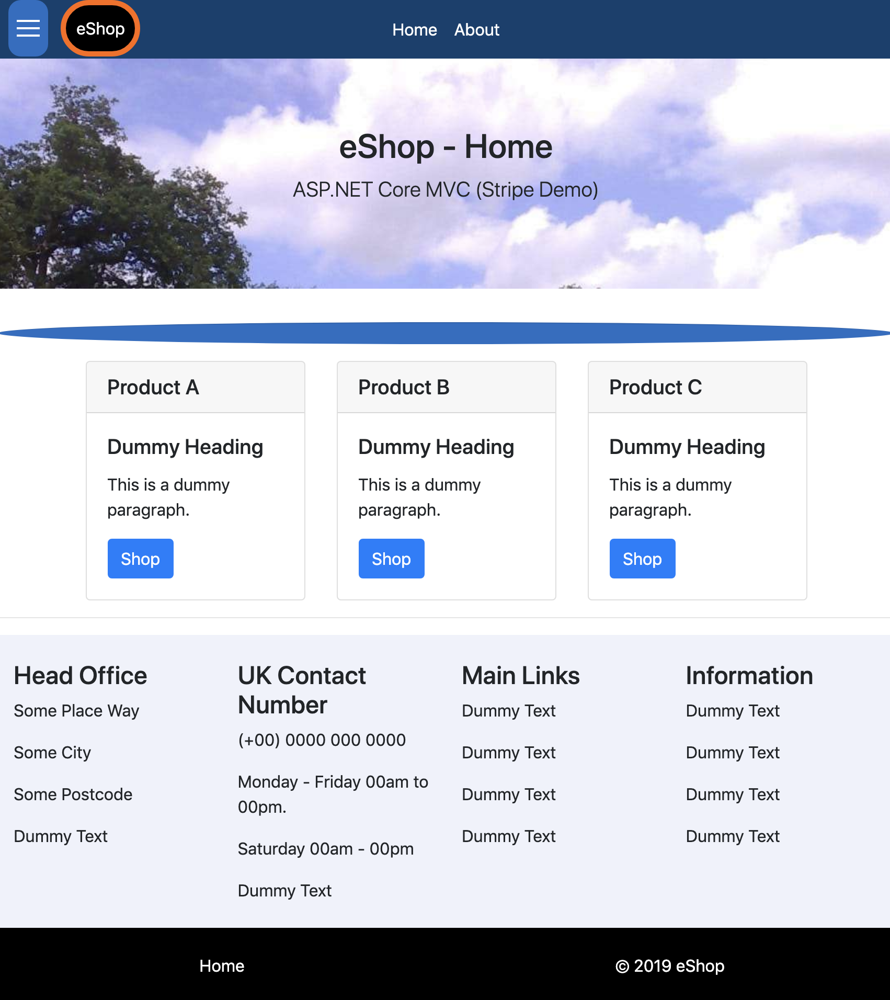

# ASP.NET Core - Simple Stripe eShop

## ASP.NET Core MVC - Simple Stripe eShop

<!-- Home Page : https://site.com/ -->
 

# Section Heading
<!-- | Sub-heading Title        | Sub-heading Items          |
| ------------- |:-------------:|
| A demo link |https://some-site.com/  |
| None link text |
| -->

### This demo App uses ASP.NET Core MVC and Stripe.NET to implement a simple online shop.

#### Configuration data such as Strime secret and publishable keys must be supplied in the AppSettings.json file for the app to work.

